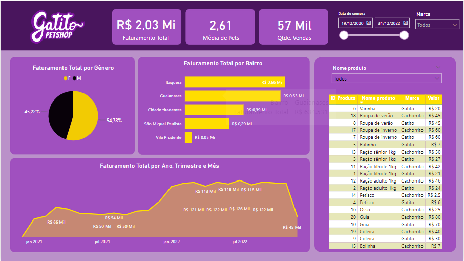
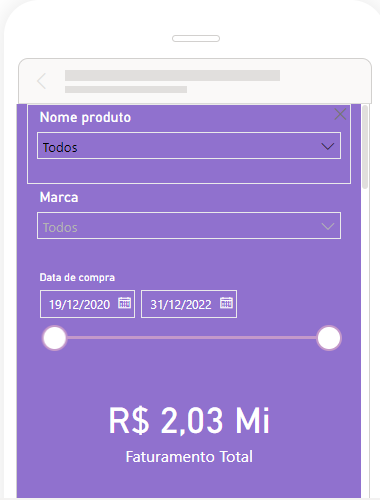

### Gatito Dashboard - Power BI

Projeto realizado na formação Power BI da Alura, mais especificamente no curso "Power BI Desktop: construindo meu primeiro dashboard", ministrado pelo professor Daniel Siqueira.

O projeto tem como intuito mostrar dados de um petshop de nome Gatito (empresa fictícia). Os gráficos no dashboard são disponibilizados tanto no formato desktop quanto no formato mobile.

### Orientações

Lembre-se de verificar ao baixar os arquivos na sua máquina, o caminho das bases dentro do Power BI.

#### Visão Desktop 

#### Visão Mobile

